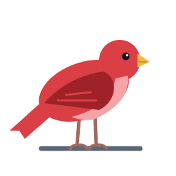
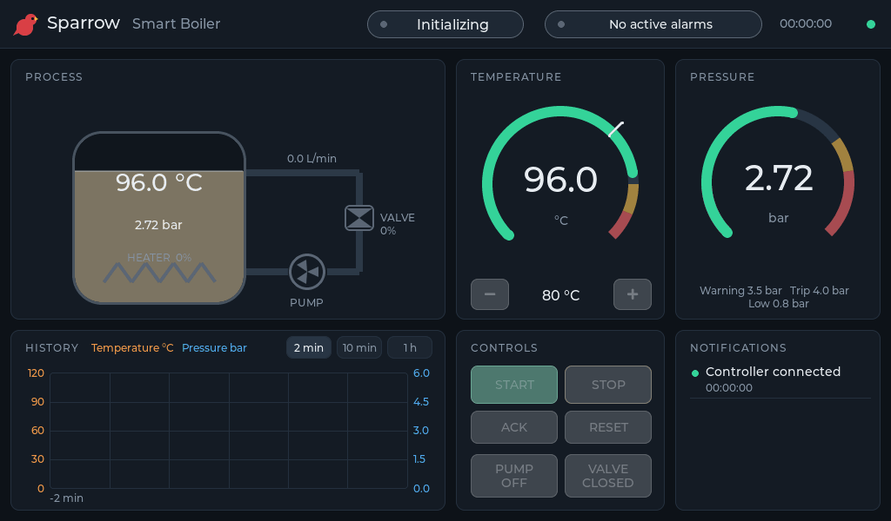
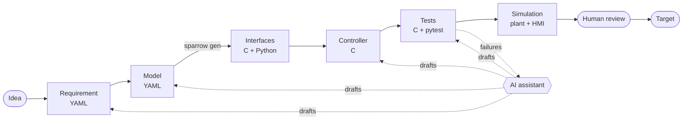
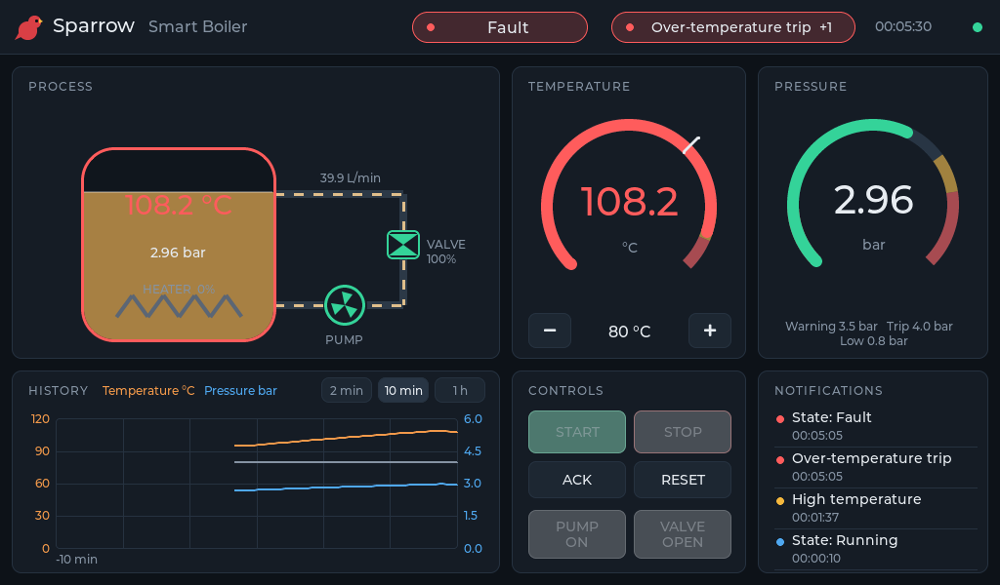

<div align="center">



# Sparrow

**Build embedded. Think bigger.**

[](https://github.com/JGalego/Sparrow/actions/workflows/ci.yml)
[](LICENSE)


</div>

Sparrow is an open-source framework for building embedded control systems with graphical HMIs, from requirements to a running target. Its reference application is a Smart Boiler.



## From idea to boiler

Every feature takes the same path. Each step produces a plain-text artifact in Git and is checked by a deterministic tool. The boiler's over-temperature trip went through it like this:



**1. Requirement.** The behaviour is stated with its reason and the parameters it depends on ([requirements/controller.yaml](examples/smart-boiler/requirements/controller.yaml)):

```yaml
- id: REQ-006
  title: Over-temperature trip
  statement: >
    When the boiler temperature exceeds temperature_trip_c the controller shall,
    in the same control step, open the heater contactor, set the heater power
    to zero, latch the over-temperature alarm and enter FAULT.
  parameters: [temperature_trip_c, temperature_hysteresis_c]
```

**2. Model.** The fault and its limit become part of the interface ([model/boiler.yaml](examples/smart-boiler/model/boiler.yaml)):

```yaml
faults:
  - {name: OVER_TEMP, severity: critical, text: Over-temperature trip, requirement: REQ-006}
config:
  - {name: temperature_trip_c, default: 110.0, min: 30.0, max: 200.0, unit: degC}
```

**3. Interfaces.** `sparrow gen` writes the C structs, enums and config defaults for the controller and HMI, and the matching ctypes module for the plant. `make lint` fails if the committed files are stale.

**4. Code.** The controller is plain C with one entry point, `boiler_step(inputs, commands, dt_ms) -> outputs`. It has no I/O, no clock and no allocation.

**5. Tests.** Tests cite the requirement they verify. Limits are tested at the boundary, and fault behaviour is tested in closed loop against the plant model:

```c
SP_TEST(over_temperature_trips_above_the_limit, "REQ-006") { ... }   /* 109.9, 110.0, 110.1 */
```

```python
@pytest.mark.verifies("REQ-006,REQ-016")
def test_shorted_heater_relay_is_stopped_by_the_over_temperature_trip(running_bench): ...
```

**6. Trace.** `sparrow trace` joins requirements, implementation and tests, and fails on a requirement that no test verifies, a test that cites an unknown ID, or an implementation reference that no longer exists. The full matrix is in [docs/traceability.md](docs/traceability.md).

```sh
sparrow trace examples/smart-boiler/sparrow.yaml --requirement REQ-006
```

**7. Simulation.** The desktop simulator runs the real controller library against the plant and streams its status to the HMI. Scenarios replay faults on a schedule, and the SIM panel injects them by hand. `scripts/run-desktop.sh --scenario over-temperature --speed 10` shows the trip happen:



**8. Deployment.** The same controller and HMI sources cross-compile for embedded Linux (`target-aarch64`, framebuffer and touchscreen). The reference target is NXP i.MX 8 class hardware, but no code depends on it.

## Where AI fits in

`sparrow ai` drafts the artifacts of steps 1 to 5 and reviews what comes out of steps 5 and 7. It works with Anthropic, OpenAI, and OpenAI-compatible servers such as Ollama or Groq:

```sh
pip install -e '.[ai]'
cp ai.example.yaml sparrow-ai.local.yaml      # pick a profile; keys stay in env vars
export SPARROW_PROJECT=examples/smart-boiler/sparrow.yaml

sparrow ai requirements "Warn if heat-up takes longer than 20 minutes"   # 1
sparrow ai model REQ-042                                                  # 2
sparrow ai code REQ-042                                                   # 4
sparrow ai tests REQ-042 --verify                                         # 5, then gates
sparrow ai explain                                                        # failing tests
sparrow ai analyze run.csv --requirement REQ-012                          # 7, simulation trace
sparrow ai review main                                                    # before merging
```

The traceability data selects the context: the requirement, the code that implements it, and the tests that cite it. Each draft comes back as a patch limited to the files its stage may change. With `--verify`, it is applied and must pass the same gates as a human change: `sparrow gen`, lint, the tests and `sparrow trace`. A person reviews it before it merges.

AI is never part of the build, the tests, the simulator or the deployed control loop, and everything else in this repository works without it. Configuration, providers and every stage are covered in [docs/ai.md](docs/ai.md).

## Philosophy

- **Determinism.** The controller's outputs depend only on its configuration, its inputs and the step length. A test run on a laptop behaves exactly like the target.
- **Explicit artifacts.** Requirements, interfaces, faults and scenarios are human-readable files. Nothing important lives in a tool's database or a prompt history.
- **Separation.** Specification, controller, plant, HMI and platform code are separate modules. Any one of them can be replaced or used on its own.
- **Workstation first.** The whole loop runs on a Linux desktop before any hardware is involved.
- **Boring technology.** C11, CMake, Python, pytest, LVGL and YAML.

## Quick start

Requirements: Linux, CMake 3.20+, a C11 compiler, Python 3.10+, SDL2 headers (`libsdl2-dev`) and Git. The first configure downloads LVGL v9.2.2.

```sh
make setup    # Python virtual environment with the sparrow tools
make build    # controller, HMI and tests
make run      # simulator + desktop HMI
make test     # C unit tests, closed-loop tests, traceability with results
make lint     # ruff, clang-format, cppcheck, stale generated code and trace
```

## License

MIT. See [LICENSE](LICENSE). LVGL is MIT-licensed and fetched at build time.
