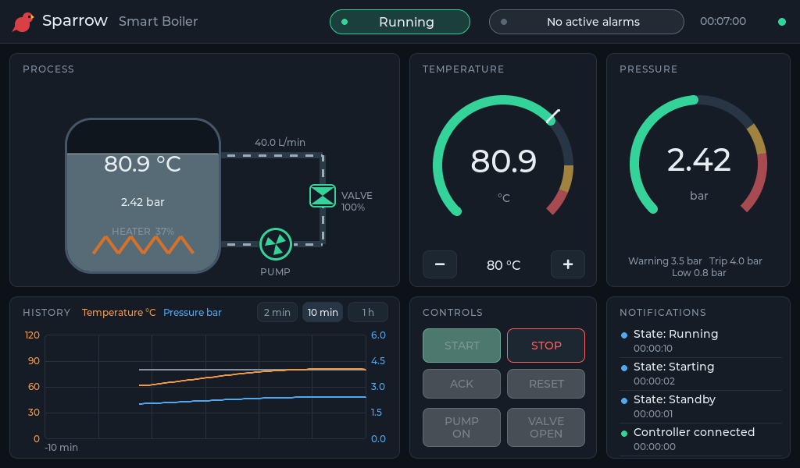
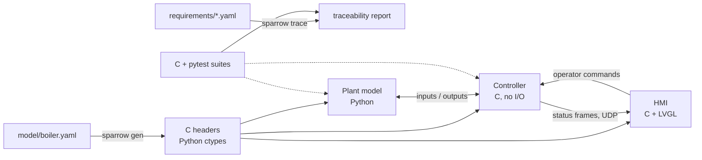
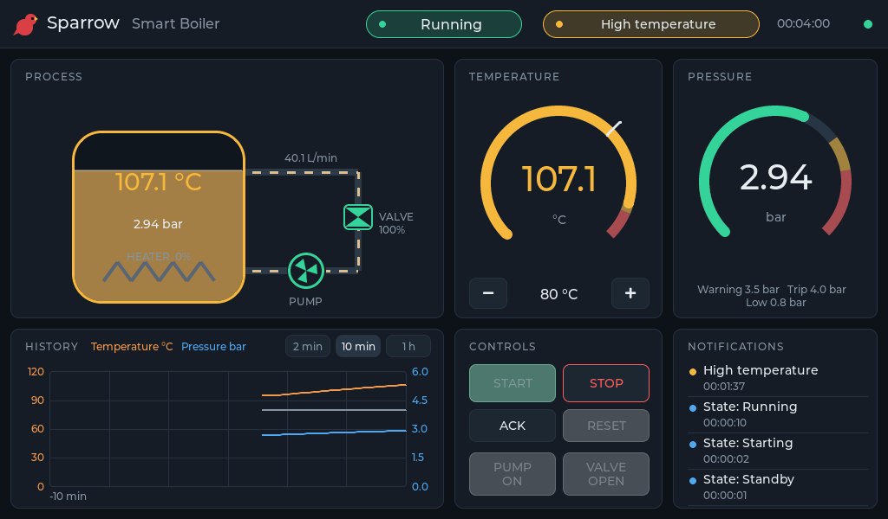
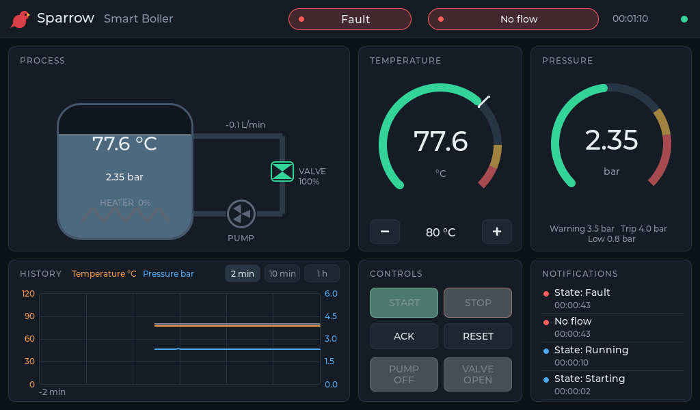
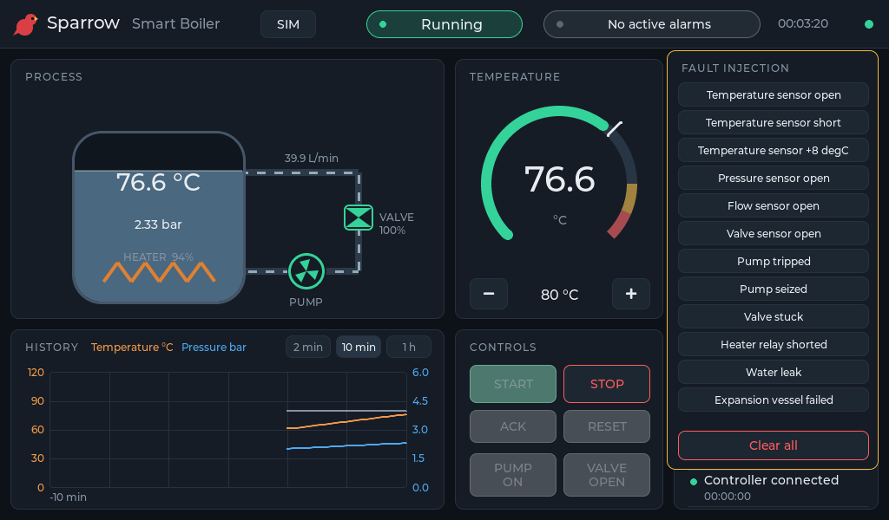

<div align="center">


# Sparrow

**Build embedded. Think bigger.**

[](https://github.com/JGalego/Sparrow/actions/workflows/ci.yml)
[](LICENSE)


</div>

Sparrow is an open-source framework for building embedded control systems with graphical HMIs, from requirements to a running target.



One YAML model defines the interfaces: signals, states, faults, configuration and wire frames. Sparrow generates the C and Python code for them. The controller is plain C with an explicit state machine and a fixed-step `step(inputs, commands, dt) -> outputs` function. A Python plant model with fault injection drives it in closed loop on a workstation. An LVGL HMI renders its status on the desktop or on an embedded Linux framebuffer. Requirements are YAML files that tests cite by ID, and `sparrow trace` checks both sides.



The controller has no dependency on the HMI, the plant or the network. It never allocates memory, reads a clock or keeps global state, so the same inputs give the same outputs on the desktop, in CI and on the target. AI tooling is optional and never part of the deployed control loop.

## Smart Boiler

The reference application is a pressurized hot-water boiler with a heater, a circulation pump, a motorized valve and four 4-20 mA transmitters. The controller sequences startup and shutdown, regulates temperature with a PI loop, and supervises 12 fault conditions. It trips to a safe state on over-temperature, over-pressure, low pressure, pump, flow, valve and sensor failures.

A welded heater relay drives the temperature past the 100 °C warning:



At 110.1 °C the controller opens the heater contactor, latches the alarm and keeps the pump circulating while the boiler cools:


A seized pump still reports "running" on its contactor. Only the flow measurement reveals it:



In the desktop simulator, the SIM panel injects any modelled plant fault at run time:



## Repository

| Path | Contents |
|---|---|
| `sparrow/core` | C: alarms, persistence timers, PI regulator, history ring, frame codec |
| `sparrow/hmi` | C: LVGL theme and reusable widgets (gauge, trend, pill, panel, notifications) |
| `sparrow/platform` | C: display backends (SDL, framebuffer, headless), UDP, screenshots |
| `sparrow/codegen`, `sparrow/requirements`, `sparrow/simulation` | Python: `sparrow gen`, `sparrow trace`, plant interface, scenarios, link |
| `examples/smart-boiler` | The boiler: model, requirements, controller, HMI, plant, scenarios, tests |

## Quick start

Requirements: Linux, CMake 3.20+, a C11 compiler, Python 3.10+, SDL2 development headers (`libsdl2-dev`) and Git. The first configure downloads LVGL v9.2.2.

```sh
make setup    # Python virtual environment with the sparrow tools
make build    # controller, HMI and tests (build/host)
make run      # simulator + desktop HMI
```

`make run` passes extra options to the simulator through `scripts/run-desktop.sh`. For example, `scripts/run-desktop.sh --scenario over-temperature --speed 10` replays a fault scenario at 10x speed.

## Testing

```sh
make test         # C unit tests, closed-loop pytest suites, traceability with results
make test-asan    # C tests under AddressSanitizer and UBSan
make lint         # ruff, clang-format, cppcheck, stale generated code, stale trace
```

Every limit is tested at its boundary. With the 110.0 °C trip, 109.9 and 110.0 do not trip and 110.1 does. To see what verifies a requirement:

```sh
sparrow trace examples/smart-boiler/sparrow.yaml --requirement REQ-006
```

The full matrix of requirements, implementation and tests is in [docs/traceability.md](docs/traceability.md).

## Embedded Linux

The `target-aarch64` preset cross-compiles the controller and HMI for 64-bit ARM boards such as the NXP i.MX 8. It uses the Linux framebuffer with an evdev touchscreen, and nothing in the code depends on NXP hardware.

```sh
cmake --preset target-aarch64 && cmake --build --preset target-aarch64
```

## License

MIT. See [LICENSE](LICENSE). LVGL is MIT-licensed and fetched at build time.
