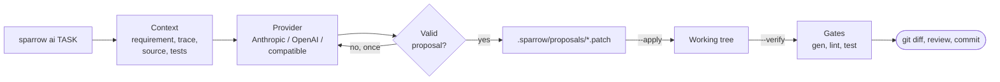

# AI assistance

`sparrow ai` asks a language model to draft engineering artifacts: requirements, model changes, controller code, tests, HMI code and documentation. It can also review a change, explain failing tests and analyse a simulation run. Each draft comes back as a patch for a person to review and for the project's gates to check. Nothing outside `sparrow/ai` imports it. The build, the tests, the simulator and the deployed controller run without it.



## Install

The provider SDKs are an optional extra:

```sh
.venv/bin/pip install -e '.[ai]'
```

## Configure

Configuration lives in profiles in a YAML file. The first file found is used:

1. the path in `$SPARROW_AI_CONFIG`
2. `sparrow-ai.local.yaml` in the current directory (ignored by Git)
3. `~/.config/sparrow/ai.yaml`

Start from [ai.example.yaml](../ai.example.yaml):

```sh
cp ai.example.yaml sparrow-ai.local.yaml
export ANTHROPIC_API_KEY=<your key>
sparrow ai config        # resolved settings; the key is shown only as set / NOT SET
sparrow ai ping          # one short request to check the provider
```

The file's `default` selects a profile. `--profile NAME` or `SPARROW_AI_PROFILE` selects another. Environment variables override individual settings: `SPARROW_AI_PROVIDER`, `SPARROW_AI_MODEL`, `SPARROW_AI_BASE_URL`, `SPARROW_AI_API_KEY_ENV`, `SPARROW_AI_MAX_TOKENS`, `SPARROW_AI_TEMPERATURE`, `SPARROW_AI_EFFORT`, `SPARROW_AI_TIMEOUT_S`, `SPARROW_AI_MAX_RETRIES`, `SPARROW_AI_STREAM` and `SPARROW_AI_STRUCTURED_OUTPUT`. Without any file, `SPARROW_AI_PROVIDER=anthropic` alone gives a working Anthropic setup.

| Setting | Default | Meaning |
|---|---|---|
| `provider` | required | `anthropic`, `openai` or `openai-compatible` |
| `model` | `claude-opus-5-5` for Anthropic, otherwise required | Model ID as the provider names it |
| `base_url` | provider default | Required for `openai-compatible` |
| `api_key_env` | `ANTHROPIC_API_KEY` / `OPENAI_API_KEY` | Environment variable holding the key |
| `max_tokens` | 16000 | Reply length limit |
| `temperature` | unset | Passed only where the model accepts it |
| `effort` | unset | Anthropic `output_config.effort`, OpenAI `reasoning_effort` |
| `timeout_s` | 300 | Per request |
| `max_retries` | 2 | SDK retries on 408, 409, 429, 5xx and connection errors |
| `stream` | true | Stream replies (progress dots on stderr) |
| `structured_output` | `auto` | `json_schema`, `json_object` or `prompt`, see below |
| `refusal_fallback` | true | Anthropic server-side fallback when a request is declined |
| `max_context_chars` | 400000 | Hard limit on the request; exceeding it is an error, not a truncation |

Keys belong in environment variables. A profile may hold `api_key` directly, but loading refuses one from a file that Git tracks.

### Providers

**Anthropic** uses the official `anthropic` SDK. Replies are constrained to the task's JSON schema (`output_config.format`). For `claude-opus-5-5`, `claude-opus-5`, `claude-sonnet-5-5` and `claude-fable-5-1`, requests enable the server-side refusal fallback (`fallbacks: "default"`), so a policy decline is retried on another model within the same call. Set `refusal_fallback: false` to turn it off. Current models reject sampling parameters, so a configured `temperature` is dropped with a note. Older models such as `claude-haiku-4-5` receive it.

**OpenAI** uses the official `openai` SDK against Chat Completions, with strict JSON-schema output and `max_completion_tokens`.

**OpenAI-compatible** servers use the same SDK with `base_url`. They differ in what they accept, so their capabilities come from the configuration:

| `structured_output` | Request | Use with |
|---|---|---|
| `json_schema` | `response_format` with the schema | Ollama, vLLM, and Groq on models that support it |
| `json_object` (the `auto` default) | `response_format: json_object`, schema in the prompt | Most servers, including Groq |
| `prompt` | Schema in the prompt only | Servers without `response_format` |

Local servers need no key. The SDK is given a placeholder.

Ollama truncates prompts to its context length (4096 tokens unless configured) without an error. Sparrow requests are typically 10k to 25k tokens, so start the server with a larger context, for example `OLLAMA_CONTEXT_LENGTH=32768 ollama serve`. Replies whose reported prompt size is far below what was sent carry a truncation note. On CPU-only machines a 7B model can take many minutes per request, so raise `timeout_s` accordingly.

## Using it at each stage

Set the project once:

```sh
export SPARROW_PROJECT=examples/smart-boiler/sparrow.yaml
sparrow ai tasks         # task, stage, argument, what it may change
```

Every task accepts `--dry-run`, which prints what would be sent and sends nothing:

```text
$ sparrow ai tests REQ-006 --dry-run
     663  requirement REQ-006
    5537  file examples/smart-boiler/controller/boiler_faults.c (implements it)
    5402  file examples/smart-boiler/controller/boiler_sequence.c (implements it)
   11713  file examples/smart-boiler/tests/c/test_boiler_faults.c (verifies it)
   10734  file examples/smart-boiler/tests/python/test_closed_loop.py (verifies it)
    3210  file examples/smart-boiler/tests/c/boiler_fixture.h (test fixtures)
     840  file examples/smart-boiler/tests/python/conftest.py (test fixtures)
   39159  total characters in the request
```

The traceability data selects the context. A task about a requirement receives the requirement, the files its `implementation` entries name, and the tests that cite it.

### 1. Requirements

```sh
sparrow ai requirements "Warn when the boiler takes longer than 20 minutes to reach the setpoint"
```

Context: all requirement files and the model. The proposal adds entries with the next free ID and may change only `requirements/*.yaml`. Check it with `sparrow trace`, which will report the new requirement as unverified until tests cite it.

### 2. Model

```sh
sparrow ai model REQ-042
```

Context: the requirement, its implementation and tests, and `model/boiler.yaml`. The proposal may change only the model. Generated files are protected, and an edit to one is rejected. After applying, `make gen` rebuilds the C and Python interfaces.

### 3. Interfaces

No AI. `sparrow gen` is deterministic, and `make lint` fails if the committed output is stale.

### 4. Controller code

```sh
sparrow ai code REQ-042
```

Context: the requirement, the controller sources and the generated header (read-only). The proposal may change `controller/*` and the requirement's `implementation` list. The prompt restates the controller's constraints: no clock, no allocation, no global state, time only through `dt_ms`.

### 5. Tests

```sh
sparrow ai tests REQ-042
sparrow ai explain                                  # after a failing `make test`
sparrow ai explain 'build/host-headless/results/*.xml'
```

`tests` receives the requirement, its implementation, the tests that already cite it, and the fixtures. It is asked for boundary cases (below, at and above each limit) and failure behaviour, with every test citing the requirement. `explain` reads the JUnit results, collects each failing test with its requirement and implementation, and reports whether the test, the code or the requirement is wrong. It writes nothing.

### 6. Trace

No AI. `sparrow trace` checks that the new requirement is implemented and verified.

### HMI and documentation

```sh
sparrow ai hmi "Show heater power as a bar under the process view"
sparrow ai docs "Document the scenario file format"
```

`hmi` receives the application screen and the widget library, and may change both. `docs` receives the README and `docs/*.md`, and is asked to describe only what exists. `docs/traceability.md` is generated and protected.

### 7. Simulation

```sh
python -m smart_boiler --scenario pump-seized --speed 50 --stop-at-s 120 --csv run.csv
sparrow ai analyze run.csv --scenario examples/smart-boiler/scenarios/pump-seized.yaml --requirement REQ-012
```

The model does not receive the raw rows. It receives a deterministic summary: value ranges, every state change, and every alarm raised or cleared, with timestamps. The report checks the run against the requirements and flags marginal behaviour.

### Review

```sh
sparrow ai review            # working tree against HEAD
sparrow ai review main       # branch against main
```

Context: the diff and the requirements implemented by the files it touches. The report lists findings as `SEVERITY file:line [REQ]: text`. It reviews in addition to a person, not instead of one.

## Proposals

Proposal tasks reply with a JSON object: a summary, a rationale, and a list of edits. Each edit is either an exact search/replace in an existing file or the full content of a new file. Before anything is written, Sparrow checks that:

- every path lies inside the repository and matches the task's `ai.paths` in `sparrow.yaml`,
- no edit touches a generated or protected file,
- every search text occurs exactly once in its file, and every created file does not exist yet.

A rejected reply goes back to the model once with the reason (`--attempts` sets the count). A second rejection is an error. Nothing is written in either case.

A valid proposal is printed as a unified diff and saved to `.sparrow/proposals/` as `.patch` and `.json`. The directory is ignored by Git.

```sh
sparrow ai tests REQ-042              # print and save the patch
git apply .sparrow/proposals/<file>.patch
sparrow ai tests REQ-042 --apply      # write it to the working tree
sparrow ai tests REQ-042 --verify     # write it, then run the gates
```

`--verify` runs the `ai.gates` commands from the repository root and stops at the first failure. For the Smart Boiler these are `make gen`, `make lint` and `make test`. A proposal that fails a gate stays in the working tree for inspection. `git checkout -- .` discards it. The command exits non-zero if a gate fails.

## Testing

`tests/python/ai` runs the three adapters through the real SDKs against a local HTTP server that imitates both APIs. It checks headers, request bodies, streaming, structured output, retries and error mapping. The task runner is tested end to end with a scripted provider on a throwaway repository. None of these tests need a network or a key.
