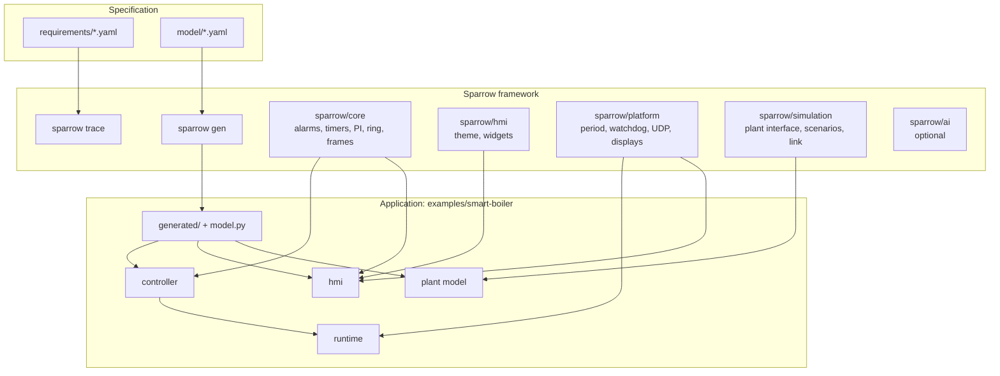
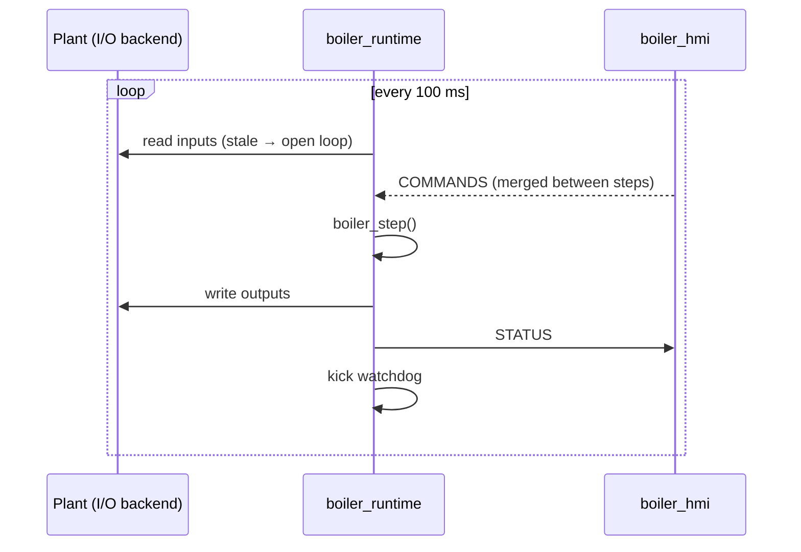

# Architecture

Sparrow separates five things that embedded projects tend to blur together: the specification (requirements and model), the controller, the plant, the HMI and the platform. Each is a separate library or package with an explicit interface, and each can be built and tested on its own.



## Dependency rules

- The controller depends only on `sparrow/core` and the generated model. It has no I/O, no clock, no allocation and no global state. It compiles for any C11 target.
- The HMI view model (`hmi/boiler_view.c`, `boiler_app.c`, `boiler_notify.c`, `boiler_actions.c`) has no LVGL dependency and is unit-tested. Widgets only render a view model. They hold no rules about limits or states.
- The plant knows nothing about the controller. It consumes actuator values and produces loop currents.
- `sparrow/platform` is the only code that touches the OS: the display, input devices, sockets, the monotonic clock and the watchdog. `sparrow_rt` is its display-free part, used by the runtime.
- `sparrow/ai` is imported by nothing but the `sparrow ai` command ([ADR 1](adr/0001-ai-outside-the-control-loop.md)).

## Data flow

The controller is a function called once per period:

```c
void boiler_step(BoilerController *c, const BoilerInputs *inputs,
                 const BoilerCommands *commands, uint32_t dt_ms, BoilerOutputs *outputs);
```

Inside one step: scale and validate inputs → update fault conditions and alarms → apply acknowledge → run the state machine (commands, transitions, outputs) → set the horn → advance timers. Operator commands are edge requests consumed by the step that receives them.

Three hosts run this function:

| Host | Where | Time source | I/O |
|---|---|---|---|
| `smart_boiler.bench` | pytest, `python -m smart_boiler` | fixed 100 ms steps | Python plant, in process (ctypes) |
| `boiler_runtime` | target, SIL on the desktop | `CLOCK_MONOTONIC`, 100 ms period | `BoilerIo` backend |
| C unit tests | CTest | fixed steps | test fixture |

On the desktop the simulator runs the controller library in process. On a target the runtime runs it and talks to the HMI over the same link:



Frames are a 16-byte header plus a generated struct, carried in UDP ([ADR 3](adr/0003-udp-frames-with-raw-structs.md)):

| Kind | Payload | Direction |
|---|---|---|
| 1 STATUS | `BoilerStatus` (56 B) | controller → HMI |
| 2 COMMANDS | `BoilerCommands` | HMI → controller |
| 3 FAULT_INJECTION | `BoilerFaultInjection` | HMI → simulator or plant |
| 4 INPUTS | `BoilerInputs` | plant → runtime |
| 5 OUTPUTS | `BoilerOutputs` | runtime → plant |

## Code generation

`sparrow gen model/boiler.yaml` writes `generated/boiler_model.h`, `generated/boiler_model.c` and `smart_boiler/model.py`. The model defines states, faults (bit positions in the alarm masks), structs with explicit padding, frame kinds, configuration parameters with default and range, and the plant fault catalog. Struct sizes are asserted on both sides ([ADR 2](adr/0002-single-model-file.md)).

## Traceability

A requirement names the parameters it uses and the functions that implement it (`path::symbol`). A test names the requirements it verifies, with `SP_TEST(name, "REQ-006")` in C or `@pytest.mark.verifies("REQ-006")` in Python. `sparrow trace` joins the two sides and fails when:

- a requirement verified by test has no test,
- a test cites an unknown requirement,
- an implementation reference no longer resolves,
- a requirement names an unknown parameter,
- a model fault cites an unknown requirement.

With `--results`, it adds pass/fail from the JUnit files of the last run. `docs/traceability.md` is generated, and `make lint` fails when it is stale.

## Safety assumptions

These are ordinary software engineering measures, not a certified safety function. A real installation needs independent protection, such as a mechanical safety valve and a hardware over-temperature cut-out, that does not depend on this software.

- Trips act in the step that detects them. Debounce applies only to conditions where a single sample is not meaningful: sensor range, low pressure, flow loss, and pump and valve feedback.
- The heater contactor is the final heat-removal path, independent of the power relay. Every trip opens it.
- Lost I/O is handled as open-circuit sensors, so it reuses the sensor-fault path.
- Latched faults need an explicit reset, and the reset is refused while the condition persists.
- The runtime kicks a hardware watchdog only after a completed step, and de-energizes all outputs on a clean exit.
