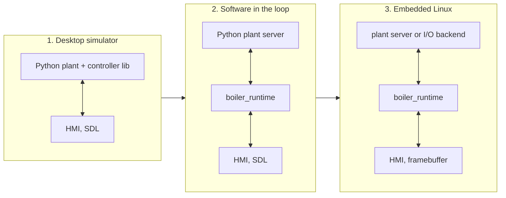

# Running and deploying

The same controller sources run in three configurations. Each step replaces one simulated part with a real one.



## 1. Desktop simulator

```sh
make build
make run                                           # demo scenario at 5x
scripts/run-desktop.sh --scenario over-temperature --speed 10
```

The simulator loads `libboiler_controller.so` and steps it in lock-step with the plant, then paces the pair in real time. The HMI's SIM button opens the fault injection panel.

The HMI renders headlessly for screenshots and recordings:

```sh
scripts/snapshot.sh pump-seized 70 shot.png --range 2m
scripts/record-gif.sh over-temperature 30 110 100 demo.gif --range 2m
scripts/capture-screenshots.py                     # regenerate docs/assets
```

## 2. Software in the loop

```sh
make run-sil                                       # plant server, runtime, HMI
scripts/run-sil.sh --speed 5 --scenario pressure-fault
```

`boiler_runtime` is the binary that runs on the target. Here it runs against `python -m smart_boiler.plant_server` over UDP. The controller now keeps its own time, from `CLOCK_MONOTONIC` at a 100 ms period, and the link can be lost. The runtime reacts as REQ-023 requires: no control step before the first inputs, and open-loop inputs (then FAULT) when they stop. `tests/python/test_runtime_sil.py` checks this and the rest of the runtime's requirements with the real binary.

| Port | Listener | Traffic |
|---|---|---|
| 47301 | HMI | STATUS |
| 47302 | runtime or simulator | COMMANDS, FAULT_INJECTION |
| 47311 | runtime | INPUTS |
| 47312 | plant server | OUTPUTS, FAULT_INJECTION |

## 3. Embedded Linux

The reference target is an NXP i.MX 8 class board (Cortex-A53/A72, aarch64) running a Yocto or Debian image with a framebuffer display and an evdev touchscreen. Nothing in the code is specific to NXP. Any aarch64 Linux board with `/dev/fb0` works, and `cmake/toolchains/` takes other toolchains.

### Build

With the distribution cross compiler (`gcc-aarch64-linux-gnu`):

```sh
cmake --preset target-aarch64
cmake --build --preset target-aarch64
```

With a Yocto SDK, source its environment and point the toolchain file at the SDK compiler and sysroot:

```sh
source /opt/fsl-imx-xwayland/<version>/environment-setup-armv8a-poky-linux
cmake --preset target-aarch64 \
    -DSPARROW_TOOLCHAIN_PREFIX=aarch64-poky-linux- \
    -DSPARROW_SYSROOT="$SDKTARGETSYSROOT"
cmake --build --preset target-aarch64
```

The build produces `boiler_runtime` and `boiler_hmi` (framebuffer and evdev backends, no SDL). The controller and its C tests can also be checked on the build machine under qemu:

```sh
cmake --preset target-aarch64-test && cmake --build --preset target-aarch64-test
ctest --preset target-aarch64-test                 # runs the aarch64 binaries in qemu-aarch64
```

CI runs both (`scripts/ci-cross.sh`).

### Install

```sh
scp build/target-aarch64/examples/smart-boiler/boiler_{runtime,hmi} root@board:/usr/bin/
scp examples/smart-boiler/deploy/*.service root@board:/etc/systemd/system/
ssh root@board systemctl enable --now boiler-runtime boiler-hmi
```

`boiler-runtime.service` runs the runtime at FIFO priority 50, binds all interfaces, and kicks `/dev/watchdog0`. Set `PLANT_HOST` to the machine running `plant_server --bind 0.0.0.0 --host <board>` for a board-in-the-loop setup. `boiler-hmi.service` starts the HMI on `/dev/fb0` with the touchscreen at `/dev/input/event0`. Other devices are set in `SpDisplayConfig` in `hmi/main.c`.

### Hardware I/O

Field I/O goes through `BoilerIo` (`runtime/boiler_io.h`): a `read` that returns whether the inputs are fresh, and a `write`. The UDP backend (`boiler_io_udp.c`) is the only one in the repository. A board backend reads the four loop currents (for example from an IIO ADC under `/sys/bus/iio/devices/`) and the pump contactor feedback, and drives the heater relay, contactor, pump, valve and horn (for example GPIO lines through `/dev/gpiochipN`). It must follow the contract in the header: never block for long, and return open-loop values when it cannot read. Outputs must also de-energize in hardware when the process dies, which is what the watchdog and fail-safe wiring are for.

The target build has been verified by compiling it and by running the controller and core tests as aarch64 binaries under qemu. It has not yet run on an i.MX 8 board.
