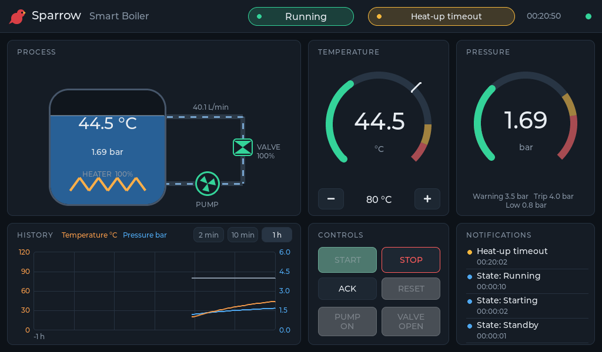

# Walkthrough: one requirement with OpenAI

A record of taking one new behaviour through every stage of [the workflow](ai.md) with `gpt-6.1-sol`, on 2026-09-29. The feature is a warning when heat-up from standby to the setpoint takes longer than 20 minutes. All commands ran on the `try-openai` branch, and each stage is its own commit there. Outputs are quoted as printed. Streaming progress dots are removed.

| Stage | Command | Time | Tokens in / out | Result |
|---|---|---|---|---|
| check | `sparrow ai ping` | 3 s | 21 / 4 | connected |
| 1 | `sparrow ai requirements ... --apply` | 20 s | not recorded¹ | REQ-042, used as written |
| 2 | `sparrow ai model REQ-042 --apply` | 14 s | 4,485 / 646 | used as written |
| 4 | `sparrow ai code REQ-042 --apply` | 67 s | 9,317 / 3,765 | correct; formatted and traced by hand |
| 5 | `sparrow ai tests REQ-042 --verify` | 572 s | 7,944 / 13,217 | gates passed, but the C test was never built |
| 5 | same, after Sparrow fixes | 533 s | 8,163 / 12,022 | 3 test defects, fixed with `explain` |
| 5 | `sparrow ai explain` (×2) | 56 s | 22,899 / 2,794 | both diagnoses correct |
| 7 | `sparrow ai analyze run.csv ...` | 23 s | 12,400 / 999 | correct, found a coverage gap |
| review | `sparrow ai review main` | 60 s | 15,746 / 2,712 | 4 valid findings |
| 5 | `sparrow ai tests REQ-042 --verify` | 201 s | 14,537 / 8,479 | found a controller defect |

Total: 95,512 tokens in and 44,638 out, $0.64 at the listed $2/$10 per million, and 26 minutes of model time.

¹ Per-request usage was added to the CLI right after stage 1.



## Setup

```yaml
# sparrow-ai.local.yaml (ignored by Git); the key is in .env, also ignored
default: openai
profiles:
  openai:
    provider: openai
    model: gpt-6.1-sol
    api_key_env: OPENAI_API_KEY
    max_tokens: 32000
    effort: medium
```

```text
$ sparrow ai ping
openai gpt-6.1-sol: 'ready' (21 in, 4 out)
```

The code and test stages ran with `SPARROW_AI_EFFORT=high`.

## 1. Requirement

```text
$ sparrow ai requirements "Warn if heat-up from standby to the setpoint takes longer than 20 minutes" --apply
# Add REQ-042 for a non-latching warning when heat-up takes more than 20 minutes.
#
# Define the timing origin, strict timeout boundary, valid-temperature completion condition,
# setpoint-change handling and warning clearing. Propose the new configuration parameter in the
# requirement rationale for a subsequent model task; leave implementation empty.
+  - id: REQ-042
+    title: Heat-up timeout warning
+    statement: >
+      On accepting a start request in STANDBY, the controller shall begin
+      monitoring heat-up, measuring elapsed controller time from the transition
+      to STARTUP, including time spent in STARTUP and RUNNING. Heat-up shall
+      complete on the first control step with a valid temperature reading at
+      or above the active setpoint. If heat-up remains incomplete for more than
+      1,200,000 ms (20 minutes), the controller shall raise a non-latching
+      warning in that control step. It shall not raise the warning at exactly
+      1,200,000 ms. Completion shall take precedence over timeout when both
+      occur in the same step. An invalid temperature reading shall not count
+      as completion and shall not pause the timer. Setpoint changes shall
+      update the completion target without restarting the timer. The warning
+      shall clear on completion or on leaving STARTUP or RUNNING for any other
+      state. Once completed or cancelled, monitoring shall remain inactive
+      until another start request is accepted in STANDBY. This warning shall
+      not change the controller state or actuator commands.
+    rationale: >
+      ... A subsequent model task should add heatup_timeout_ms, a u32 duration
+      in milliseconds with default 1200000, to make the timeout configurable;
+      no existing config parameter represents this duration.
+    priority: should
+    verification: test
+    implementation: []
```

It is precise about the timer origin, the strict boundary and the interaction with setpoint changes. It also followed the rule not to invent config parameters in `parameters` and left the new one for the model stage. The review stage later caught that the statement kept the literal 1,200,000 ms instead of naming the parameter.

## 2. Model

```text
$ sparrow ai model REQ-042 --apply
request 1: gpt-6.1-sol, 4485 tokens in, 646 out
# Add the REQ-042 heat-up timeout warning and a configurable timeout to the boiler model.
#
# Appending HEATUP_TIMEOUT preserves existing alarm bit positions and declares it as a warning
# rather than a critical fault. The u32 timeout defaults to 1,200,000 ms, with an allowed range
# of 0 to 86,400,000 ms (24 hours). ...
+  - {name: HEATUP_TIMEOUT, severity: warning, text: Heat-up timeout, requirement: REQ-042}
+  - {name: heatup_timeout_ms, type: u32, default: 1200000, min: 0, max: 86400000, unit: ms, ...}
```

It appended the fault so no existing alarm bit moved. `make gen` then regenerated the C header and source and the Python module.

## 4. Controller code

```text
$ SPARROW_AI_EFFORT=high sparrow ai code REQ-042 --apply
request 1: gpt-6.1-sol, 9317 tokens in, 3765 out
# Implement deterministic, non-latching heat-up timeout monitoring using the existing
# heatup_timeout_ms configuration. The requirement YAML edit remains pending because its file
# path was not supplied.
```

```c
static void update_heatup(BoilerController *c, BoilerState previous_state, uint32_t dt_ms)
{
    const BoilerReading *temperature = &c->measurements.temperature_c;

    if (c->state != BOILER_STATE_STARTUP && c->state != BOILER_STATE_RUNNING) {
        c->heatup_monitoring = false;
        c->heatup_elapsed_ms = 0;
    } else if (previous_state == BOILER_STATE_STANDBY && c->state == BOILER_STATE_STARTUP) {
        /* The accepting step ends at the transition; no earlier time belongs to heat-up. */
        c->heatup_monitoring = true;
        c->heatup_elapsed_ms = 0;
    } else if (c->heatup_monitoring) {
        const uint64_t elapsed = c->heatup_elapsed_ms;
        c->heatup_elapsed_ms = elapsed > UINT64_MAX - dt_ms ? UINT64_MAX : elapsed + dt_ms;
    }

    /* Completion uses the newly applied setpoint and takes precedence over timeout. */
    if (c->heatup_monitoring && temperature->valid && temperature->value >= c->setpoint_c) {
        c->heatup_monitoring = false;
    }
    const bool timed_out =
        c->heatup_monitoring && c->heatup_elapsed_ms > c->config.heatup_timeout_ms;

    sp_alarms_update(&c->alarms, BOILER_FAULT_HEATUP_TIMEOUT, timed_out, false);
}
```

The logic is correct and nothing in it changed later. The code built without warnings and the existing tests passed. Two things were done by hand:

- **Formatting.** The code was not clang-formatted. The gates now run `make format` first.
- **The requirement's `implementation` entries.** The model could not write them because the task context held the requirement as a summary, not the file it lives in, so it had no text to anchor an edit. It said so instead of guessing. The context now includes the file.

## 5. Tests

### First attempt: gates passed, nothing was tested

```text
$ SPARROW_AI_EFFORT=high sparrow ai tests REQ-042 --verify
note: attempt 1 rejected: the proposal contains no edits
request 1: gpt-6.1-sol, 3851 tokens in, 1403 out
request 2: gpt-6.1-sol, 4093 tokens in, 11814 out
gate pass: make gen
gate pass: make format
gate pass: make trace
gate pass: make lint
gate pass: make test
```

The proposal created `tests/c/test_heatup.c` but did not register it in CMake, so it was never built. It would not have compiled: it included a header that does not exist (`sparrow/test.h`), `#include`d `boiler_controller.c` to reach a static function, and compared alarm masks with a fault index. `sparrow trace` still counted its 13 tests as verifying REQ-042, because the static trace reads test files as text. Only the results-annotated report showed them as `not run`, and no gate checked that. The two Python tests it added passed, but both only showed that no warning appears on a healthy plant.

Sparrow changes made in response:

- `sparrow trace --results` (which `make test` runs) fails when a test that cites a requirement did not run.
- The tests task receives the test `CMakeLists.txt` and the harness header, and is told to register new files and to test through public interfaces.
- `make format` and `make lint` include new, untracked files.

### Second attempt

```text
request 1: gpt-6.1-sol, 8163 tokens in, 12022 out
# Add REQ-042 C boundary and failure tests, register them with CMake, and add cold/warm
# closed-loop state-regression tests.
#
# ... Coverage is not complete: testing accepted setpoint changes requires the omitted
# BoilerCommands declaration, and checking closed-loop temperature completion and warning
# bits requires the omitted bench status API.
gate pass: make gen
gate pass: make format
gate pass: make trace
gate pass: make lint
gate FAIL: make test
```

This time the tests used the fixture and `boiler_step()` and were registered with CMake. The build failed on `#include "sparrow/testing/sp_test.h"`: the model took the path from the context label, and no existing test was in view to show that the project writes `#include "sp_test.h"`. With that line fixed by hand, 8 of 9 tests failed:

```text
FAIL test_boiler_heatup.heatup_can_timeout_in_startup  test_boiler_heatup.c:150:
     BOILER_FAULT_HEATUP_TIMEOUT == f.status.alarms_active (expected 12, got 4096)
9 tests, 8 failed
```

### Explaining the failures

```text
$ sparrow ai explain
request 1: gpt-6.1-sol, 12978 tokens in, 1902 out
The failures point to a fault-ID versus alarm-bitmask mismatch in the C tests, not a
demonstrated heat-up timing defect. The equality failures show BOILER_FAULT_HEATUP_TIMEOUT
evaluates to 12 while alarms_active contains 4096 (1 << 12). Consequently, heatup_warning()
evaluates 4096 & 12, which is zero. The generated fault definitions and alarm API are needed
to confirm the representation contract before applying the fix. Nothing shown establishes
that REQ-042 is wrong.

ERROR   test_boiler_heatup.c::heatup_can_timeout_in_startup (reported line 150) [REQ-042]: The
test directly compares a fault identifier with an alarm mask ... The failure reports expected
12 and actual 4096, exactly 1 << 12. Compare against the documented fault mask instead ...
ERROR   test_boiler_heatup.c::heatup_invalid_temperature_neither_completes_nor_pauses_time
(reported line 235) [REQ-042]: ... In update_heatup(), elapsed time advances without a
validity condition, while completion requires `temperature->valid`; those lines agree with
REQ-042. The reported failure does not justify changing this implementation.
ERROR   test_boiler_heatup.c::heatup_stop_cancels_and_new_standby_start_gets_a_fresh_timer
(reported line 304) [REQ-042]: ... Negative warning checks using the current helper can pass
even when bit 12 is active, so they must be rerun after correction.
(five similar findings omitted)
```

Every finding was correct. It placed the defect in the tests, cited the controller lines that match the requirement, and pointed out that the passing negative checks proved nothing. With the mask fixed (`BOILER_FAULT_BIT(BOILER_FAULT_HEATUP_TIMEOUT)`), one failure remained, and a second run explained it:

```text
$ sparrow ai explain
request 1: gpt-6.1-sol, 9921 tokens in, 892 out
One failure is reported: the STARTUP test compares outputs across an input change as well
as the timeout boundary. That comparison does not isolate the warning's effect.

ERROR   test_boiler_heatup.c::heatup_can_timeout_in_startup, line 153 [REQ-042]: The test's
baseline is unsuitable for proving that the warning leaves actuator commands unaffected. ...
REQ-042 prohibits changes caused by the warning, not normal sequencing changes. REQ-003
explicitly makes the STARTUP pump command depend on valve position. Fix the test by taking
the baseline after the step at exactly timeout_ms, immediately before the final 1 ms step ...
INFO    requirements/controller.yaml::REQ-042 [REQ-042]: ... The rationale's reference to a
subsequent model task is stale relative to code that already uses heatup_timeout_ms ...
```

After moving the baseline and updating the stale rationale, all tests passed. The run also exposed a race in an existing runtime test (`test_shutdown_writes_safe_outputs`), which failed about one run in three. It was fixed separately.

## 7. Simulation

A scenario with a degraded 4 kW heater (`scenarios/slow-heatup.yaml`) shows the warning firing. The AI-written closed-loop tests only showed that it stays quiet.

```text
$ python -m smart_boiler --scenario slow-heatup --speed 500 --stop-at-s 1500 --csv run.csv
$ sparrow ai analyze run.csv --scenario scenarios/slow-heatup.yaml --requirement REQ-042
request 1: gpt-6.1-sol, 12400 tokens in, 999 out
No requirement violation is evident in the supplied run. The heat-up warning occurs at the
correct first overdue step, and operation continues as required. ...

WARNING slow-heatup.csv: aggregate summary and event list [REQ-013]: The summary cannot verify
the heater interlock step by step. ... This is a verification limitation, not an observed
interlock failure.
INFO    slow-heatup.csv: STARTUP at 2.1 s; HEATUP_TIMEOUT at 1202.2 s [REQ-042]: The warning
appears 1200.1 s after the accepted start, matching the strict greater-than-1200-s threshold
at a 100 ms sampling period. It does not appear at exactly 1200 s. Timing includes the 8.4 s
spent in STARTUP rather than starting at entry to RUNNING.
INFO    slow-heatup.csv: final temperature 47.065 degC versus 80 degC setpoint [REQ-004]: ...
consistent with the deliberately degraded 4 kW heater and the REQ-042 warning. It is not
evidence of failure of REQ-004's reference-plant performance criterion.

Next steps:
  - Add or confirm REQ-042 tests for setpoint changes during monitoring: raising the target
    must not restart elapsed time, lowering it to a valid current reading must complete
    immediately, and changing it after completion must not rearm monitoring.
```

A closed-loop test of this case was added during review. The setpoint-change gap is real: the tests stage had said it could not write those tests without the generated header.

## Review

```text
$ SPARROW_AI_EFFORT=high sparrow ai review main
request 1: gpt-6.1-sol, 15746 tokens in, 2712 out
No clear controller logic defect is evident in the supplied diff. The heat-up timer is
deterministic and overflow-protected, but traceability is stale and several required
behaviors and configuration boundaries lack demonstrated coverage. Gates were not executed.

ERROR   docs/traceability.md:39 [REQ-042]: The generated REQ-042 row omits
test_degraded_heater_raises_the_warning_just_after_twenty_minutes, although that test cites
REQ-042. The checked-in report is therefore stale ... Regenerate it with make trace.
WARNING requirements/controller.yaml:332 [REQ-042]: The normative statement fixes the timeout
at 1,200,000 ms, while the implementation uses heatup_timeout_ms ... Specify that timeout
occurs strictly after heatup_timeout_ms, with 1,200,000 ms as its default.
WARNING tests/c/test_boiler_heatup.c:39 [REQ-021, REQ-042]: The added tests exercise
configured timeouts of only 1,000 and 1,200,000 ms. They do not demonstrate validation of the
new 0-86,400,000 ms range or behavior at the allowed zero timeout. ...
WARNING controller/boiler_controller.c:117 [REQ-042]: Completion uses the newly applied
setpoint, but none of the added tests sends a setpoint-change command. ...
```

All four findings were valid. The first was a mistake made during review: the added test was committed after the last `make trace`. The statement was changed to name `heatup_timeout_ms`, and the generated headers were added to the context of the tests and explain tasks.

## 5 again: a defect in the controller

The third tests run added the setpoint-change tests. One of its closed-loop tests failed:

```text
    bench.command(stop=1)
    bench.step()
    assert bench.state in (State.SHUTDOWN, State.STANDBY)
>   assert bench.status.heater_contactor == 0
E   assert 1 == 0
```

The test was right. When a stop was accepted in RUNNING or STARTUP, the controller computed that state's outputs first and only then entered SHUTDOWN, so for one control period it reported "Shutting down" with the heater contactor closed. The existing shutdown tests only looked after one second, so none of them caught it. Trips were not affected, because critical faults are handled before any state's outputs are computed. The fix takes a stop in the step that accepts it, and REQ-017 now says "in the same control step", with boundary tests for both states. The configuration-range tests from the review are still missing.

## What this run showed

The model wrote the requirement, the model change and the controller logic correctly. The two text reports (`explain` and `analyze`) were accurate and careful: they said what they could not establish rather than guessing. Test generation was the weak stage. The first attempt's tests were never built, and the gates missed it. The second attempt had three defects, which the gates and `explain` found. The third attempt was correct, and its failing test exposed a real controller defect.

Most of the problems were in Sparrow, not the model: context that lacked the file to edit, the test build or the generated types, and gates that accepted an unbuilt test. Each is fixed in a separate commit on the branch. The controller defect was found by an AI-written test, after a human-written scenario had shown the positive case.

Human edits, all visible in the branch history:

- formatting;
- the requirement's `implementation` entries;
- one include line;
- the alarm mask;
- one test baseline;
- the requirement's wording;
- the controller fix.
