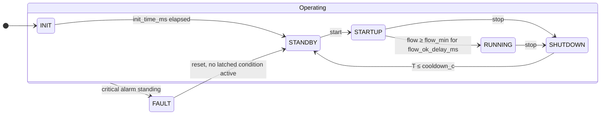
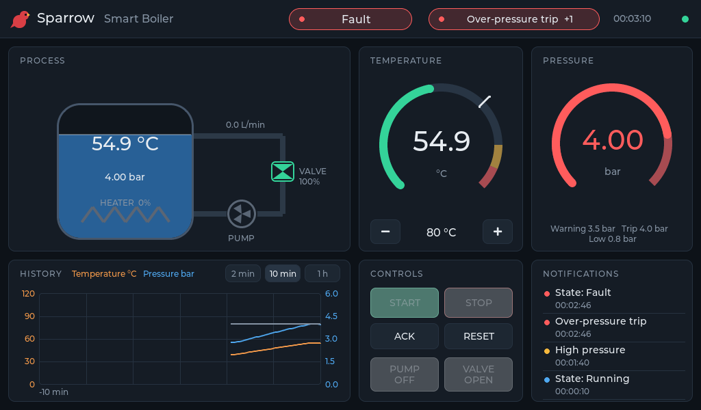
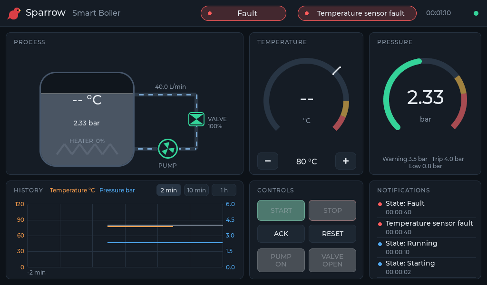

# Smart Boiler

The reference application: a pressurized hot-water boiler with an electric heater, a circulation pump, a motorized valve and four 4-20 mA transmitters (temperature, pressure, flow, valve position). The heater has two stages of switching: a solid-state relay for power control, and a safety contactor that the controller opens on any trip.

Everything specific to the boiler lives in [examples/smart-boiler](../examples/smart-boiler):

| Path | Contents |
|---|---|
| `model/boiler.yaml` | States, faults, structs, frames, configuration with ranges, plant faults |
| `requirements/*.yaml` | Controller, HMI, runtime and simulation requirements |
| `controller/` | Measurement, fault supervision, state machine, `boiler_step()` |
| `runtime/` | The target process: fixed-period loop, I/O backend, HMI link |
| `hmi/` | View model, notifications, history, and the LVGL screen |
| `smart_boiler/` | Plant model, ctypes binding, closed-loop bench, simulators |
| `scenarios/` | Timed fault and command scripts for the simulator |
| `tests/` | C unit tests and pytest closed-loop and runtime tests |

## State machine



| State | Heater | Pump | Valve |
|---|---|---|---|
| INIT | off | off | closed |
| STANDBY | off | manual | manual |
| STARTUP | off | on once the valve is ≥ 90 % open | open |
| RUNNING | PI to setpoint, only while interlock holds | on | open |
| SHUTDOWN | off | on until T ≤ 55 °C | open |
| FAULT | off, contactor open | on while hot, unless a pump, flow, valve or pressure fault stands | open |

The heater interlock (REQ-013) is evaluated every step. The contactor closes only while the temperature reading is valid, the pump feedback is on, flow is at least 5 L/min and the valve is at least 90 % open. Losing any of these opens the contactor in the same step, before any debounced fault is raised.

## Faults

Critical faults latch and force FAULT. Warnings notify and clear on their own.

| Fault | Condition (defaults) | Severity | Requirement |
|---|---|---|---|
| Sensor faults (4) | loop current outside 3.6-21.0 mA for 500 ms | critical | REQ-002 |
| Over-temperature | T > 110.0 °C | critical | REQ-006 |
| High temperature | T > 100.0 °C for 1 s | warning | REQ-007 |
| Over-pressure | p > 4.00 bar | critical | REQ-008 |
| High pressure | p > 3.50 bar for 1 s | warning | REQ-009 |
| Low pressure | p < 0.80 bar for 2 s | critical | REQ-010 |
| Pump failure | contactor feedback ≠ command for 2 s | critical | REQ-011 |
| No flow | pump on ≥ 5 s and flow < 5 L/min for 3 s | critical | REQ-012 |
| Valve failure | end position not reached 12 s after the command | critical | REQ-014 |

Every limit, delay and hysteresis is a configuration parameter in the model, with an allowed range that `boiler_init()` enforces (REQ-021).

## Screens

The screen is 1024×600, the size of common 7" industrial panels. The top bar carries the state, the most urgent alarm and the link status. The process view shows the vessel, heater, pump, valve and flow. The water color follows the temperature, and the flow animation runs only while flow is measured. Values turn amber for a warning and red for a trip, and stay red while a trip is latched.

A seized pump. The contactor reports "running", the flow falls to zero, and the controller trips on no flow and stops the pump:


A failed expansion vessel. Pressure rises with temperature through the 3.5 bar warning to the 4.0 bar trip:



An open temperature loop. The reading becomes "--", and the heater contactor opens in the same step:



## Plant model

`smart_boiler/plant.py` is a lumped-parameter model. It has one thermal mass (125 kJ/K), a 15 kW heater, losses to ambient and to a heating circuit whose heat transfer scales with flow, a pump with first-order spin-up, and a valve that travels at 12.5 %/s. Pressure is a fill pressure plus thermal expansion plus pump head against a closed valve. The transmitters add seeded noise, and the flow transmitter reads zero below 0.5 L/min. The model exists to exercise the controller with plausible dynamics and failures. It does not predict a real installation.

| Plant fault | Effect |
|---|---|
| `TEMP_SENSOR_OPEN`, `_SHORT` | loop current 0 mA or 22 mA |
| `TEMP_SENSOR_OFFSET` | temperature reads 8 °C high |
| `PRESSURE_SENSOR_OPEN`, `FLOW_SENSOR_OPEN`, `VALVE_SENSOR_OPEN` | loop current 0 mA |
| `PUMP_TRIPPED` | pump stops, feedback off |
| `PUMP_SEIZED` | no flow, feedback still on |
| `VALVE_STUCK` | valve stops moving |
| `HEATER_SSR_SHORTED` | full heater power whenever the contactor is closed |
| `LEAK` | fill pressure drains at 0.03 bar/s |
| `EXPANSION_VESSEL_FAILED` | thermal pressure rise ×4 |

## Scenarios

A scenario sets plant parameters and schedules events:

```yaml
name: over-temperature
plant:
  initial_temperature_c: 96.0
events:
  - {at_s: 2, action: command, fields: {start: 1}}
  - {at_s: 15, action: inject, fault: HEATER_SSR_SHORTED}
```

`action` is `inject`, `clear` (all faults when `fault` is omitted) or `command`, whose `fields` are `BoilerCommands` fields. The simulator loads scenarios by name from `scenarios/` or by path:

```sh
scripts/run-desktop.sh --scenario pump-seized --speed 5
python -m smart_boiler --scenario pressure-fault --speed 50 --stop-at-s 300 --csv run.csv
```
